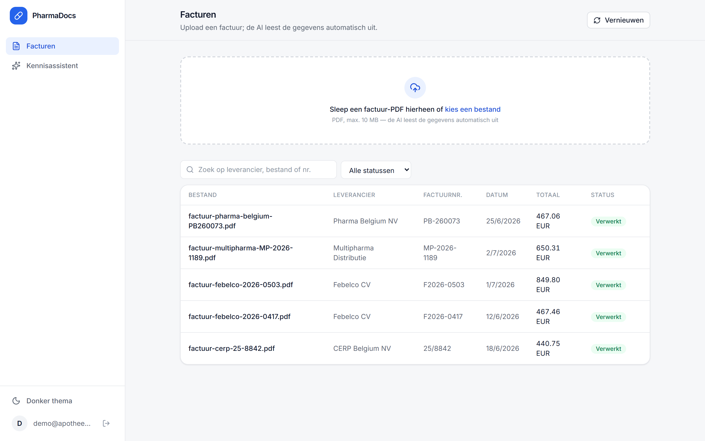
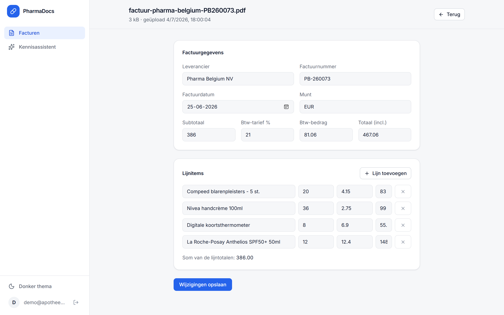
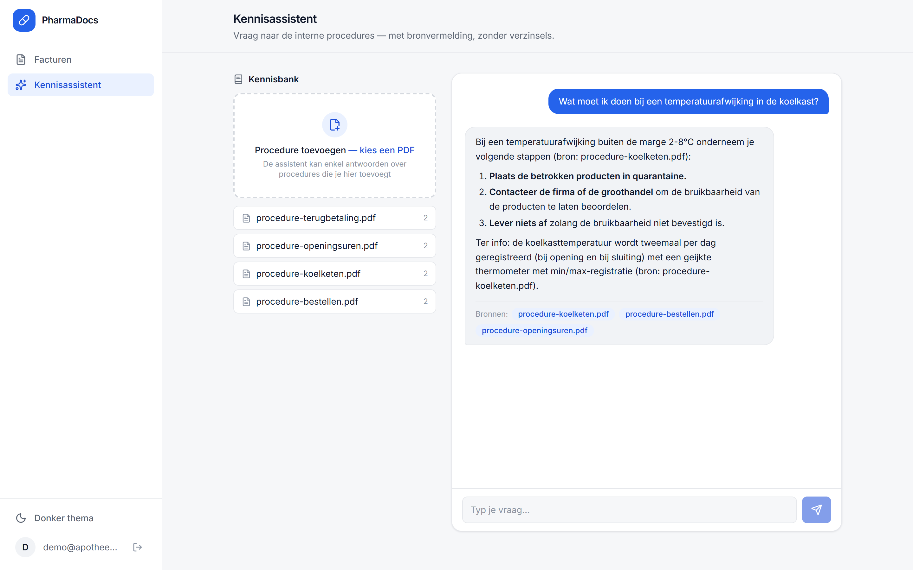
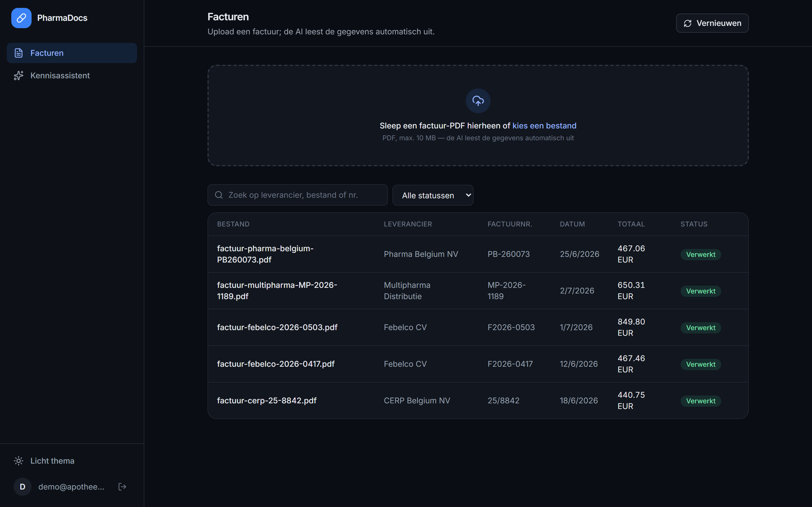
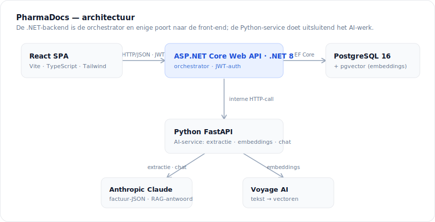

<div align="center">

# PharmaDocs

**AI-gedreven documentverwerking & interne kennisassistent voor apotheken**

[](https://github.com/ayoubboussata/PharmaDocs/actions/workflows/deploy.yml)


**[🔗 Live demo](https://pharmadocs-web.nicecliff-6142efb0.swedencentral.azurecontainerapps.io)** — draait 24/7 op Azure · toegang op aanvraag (registratie is admin-only)

</div>

<p align="center">
  
</p>

## Overzicht

PharmaDocs automatiseert het administratieve papierwerk van een apotheekgroep. Facturen en bestelbonnen worden geüpload en **automatisch omgezet naar gestructureerde data**, en een interne **chatbot beantwoordt procedurevragen** op basis van de eigen documenten — met bronvermelding en zonder verzinsels.

Het project is opgebouwd rond een duidelijke scheiding van verantwoordelijkheden: een **ASP.NET Core-backend** orkestreert en beheert de data, een **Python-microservice** verzorgt de AI-taken, en een **React-frontend** vormt de gebruikersinterface (met een licht/donker-thema).

## Functies

### 1 · Slimme documentverwerking

Upload een factuur (PDF) → de tekst wordt geëxtraheerd → een taalmodel zet ze om naar **gestructureerde JSON** (leverancier, factuurnummer, datum, subtotaal, btw-tarief en btw-bedrag, totaal, lijnitems) → opgeslagen in de databank → getoond in een doorzoekbare tabel. Elk document is doorklikbaar met een detailweergave waar je de geëxtraheerde velden **handmatig kan corrigeren**.

<p align="center">
  
</p>

Robuustheid staat centraal: de backend legt een upload eerst als `Pending` vast en roept dan pas de AI aan. Lukt de extractie, dan wordt het document `Processed`; faalt ze (AI onbereikbaar, onleesbare PDF), dan wordt het `Failed` met een foutboodschap. **Een upload gaat dus nooit verloren.**

### 2 · Interne kennisassistent (RAG)

Procedure-documenten (openingsuren, terugbetaling, koelketen…) worden in stukken geknipt en als **vector-embeddings** opgeslagen in pgvector. Bij een vraag zoekt de backend de meest relevante fragmenten op en laat het taalmodel daarop een antwoord formuleren — **met bronvermelding**, en met een expliciet "dit vind ik niet terug in de procedures" wanneer het antwoord er niet in staat. Cruciaal tegen hallucinaties in een medische context.

<p align="center">
  
</p>

De interface maakt de twee gescheiden gegevensstromen expliciet zichtbaar: **facturen** gaan naar de facturentabel, **procedures** naar de kennisbank. De assistent kan enkel antwoorden over wat in de kennisbank geïndexeerd is.

<details>
<summary>Licht &amp; donker thema</summary>

<p align="center">
  
</p>
</details>

## Architectuur

<p align="center">
  
</p>

De **.NET-backend is de orchestrator en de enige poort naar de front-end**; de **Python-service doet uitsluitend het AI-werk** (tekstextractie, prompt naar het model, embeddings) en wordt intern via HTTP aangeroepen. De front-end raakt de Python-service, de databank of de AI-API's nooit rechtstreeks aan. Zo werken de technologieën samen, elk in hun sterkte.

De backend volgt een gelaagde architectuur — `Controllers → Services → Repositories → DbContext` — met DTO's en dependency injection, zodat elke laag geïsoleerd en testbaar blijft.

## Technologie

| Laag | Technologie |
| --- | --- |
| Backend | ASP.NET Core Web API (.NET 8), Entity Framework Core, JWT-auth (BCrypt) |
| Database | PostgreSQL 16 + pgvector |
| AI-service | Python 3.12 + FastAPI |
| AI | Anthropic Claude (extractie + chat) · Voyage AI (embeddings) |
| Front-end | React + Vite + TypeScript + Tailwind CSS (zijbalk-UI, licht/donker-thema) |
| Infra | Docker · Azure Container Apps · Azure Database for PostgreSQL |

## Lokaal draaien

**Vereisten:** .NET 8 SDK, Python 3.12, Node.js, Docker Desktop.

**Sleutels** — in `ai-service/.env` (zie [`.env.example`](ai-service/.env.example)):

```dotenv
ANTHROPIC_API_KEY=sk-ant-...      # factuurextractie + RAG-antwoorden
VOYAGE_API_KEY=pa-...             # embeddings voor de kennisassistent
```

De JWT-sleutel en het dev-admin-wachtwoord komen uit .NET user-secrets (nooit in Git). Registratie is admin-only, dus het admin-wachtwoord seedt de eerste account:

```bash
cd backend/PharmaDocs.Api
dotnet user-secrets set "Jwt:Key" "<een-willekeurige-sleutel-van-min-32-tekens>"
dotnet user-secrets set "Seed:AdminPassword" "<een-sterk-wachtwoord>"
```

Inloggen doe je daarna met `admin@pharmadocs.local` + dat wachtwoord.

**Starten** (vier processen):

```bash
# 1. PostgreSQL (met pgvector) via Docker
docker compose up -d

# 2. Python AI-service
cd ai-service && python -m venv .venv && .venv/Scripts/pip install -r requirements.txt
.venv/Scripts/uvicorn app.main:app --port 8000

# 3. .NET-backend — migraties worden automatisch toegepast bij opstart
cd backend/PharmaDocs.Api && dotnet run --launch-profile http

# 4. Front-end
cd frontend && npm install && npm run dev
```

De front-end draait op `http://localhost:5173`, de API op `http://localhost:5035` (Swagger op `/swagger`), de AI-service op `http://localhost:8000`.

### API-endpoints

| Methode | Route | Auth | Omschrijving |
| --- | --- | --- | --- |
| `POST` | `/api/auth/register` | 🔒 Admin | Account aanmaken (admin-only) — geeft het nieuwe account terug, géén token |
| `POST` | `/api/auth/login` | — | Inloggen, geeft een JWT terug |
| `POST` | `/api/documents/upload` | 🔒 | Factuur-PDF uploaden → interne AI-extractie → opgeslagen document |
| `GET` | `/api/documents` | 🔒 | Overzicht van verwerkte documenten |
| `GET` | `/api/documents/{id}` | 🔒 | Detail met geëxtraheerde factuur en lijnitems |
| `PUT` | `/api/documents/{id}/invoice` | 🔒 | Handmatige correctie van de factuurkop en lijnitems |
| `POST` | `/api/knowledge/documents` | 🔒 | Procedure-PDF indexeren (chunken → embeddings → pgvector) |
| `GET` | `/api/knowledge/sources` | 🔒 | Overzicht van geïndexeerde procedures |
| `POST` | `/api/knowledge/ask` | 🔒 | Vraag stellen — antwoord uit de procedures met bronvermelding (RAG) |

## Deployment (Azure)

De drie diensten zijn gecontaineriseerd en draaien op **Azure Container Apps**, met een beheerde **Azure Database for PostgreSQL** (pgvector). Enkel de front-end is publiek; de backend en AI-service hebben **interne ingress** en zijn dus niet rechtstreeks vanaf het internet bereikbaar. TLS wordt aan de ingress geregeld. De diensten draaien standaard met minstens één warme replica (geen cold start); via `minReplicas: 0` in `infra/main.bicep` kunnen ze naar nul schalen bij inactiviteit.

Uitrollen gebeurt met één script — zie **[docs/DEPLOYMENT.md](docs/DEPLOYMENT.md)**:

```bash
export ANTHROPIC_API_KEY=...  VOYAGE_API_KEY=...
bash infra/deploy.sh
```

Het bouwt de images, maakt PostgreSQL (met de `pgvector`-extensie toegelaten) en de Container Apps aan, en zet alle sleutels als **secrets** — niets staat in de images of in Git.

## Projectstructuur

```
PharmaDocs/
├── docker-compose.yml         # PostgreSQL 16 + pgvector
├── backend/PharmaDocs.Api/    # ASP.NET Core Web API (orchestrator)
│   ├── Controllers/  Services/  Repositories/  Data/  Models/  DTOs/  Migrations/
├── ai-service/                # Python FastAPI (AI-taken)
│   ├── app/                   # endpoints, extractie, embeddings, RAG
│   └── prompts/               # versioneerde system-prompts
├── frontend/                  # React + Vite + TypeScript
└── docs/                      # architectuurschema + screenshots
```

## Wat ik geleerd heb

- **Twee technologieën netjes laten samenwerken.** De .NET-backend als orchestrator en enige poort, met de Python-service puur voor het AI-werk, houdt de verantwoordelijkheden zuiver en elke kant testbaar.
- **Betrouwbare AI-output afdwingen.** In plaats van "vraag om JSON en parse" gebruikt de extractie **geforceerde tool-use met een strikt JSON-schema**: het model kán enkel een geldige payload teruggeven. Vorm (schema) en interpretatie (prompt) blijven gescheiden.
- **RAG en anti-hallucinatie.** Zoeken op *betekenis* (embeddings + cosinus-afstand in pgvector) i.p.v. op trefwoorden, en de grounding via de prompt afdwingen — antwoorden mét bron, en eerlijk "niet gevonden" buiten de documenten.
- **Veerkrachtig ontwerp.** Een upload gaat nooit verloren (`Pending → Processed/Failed`), en zonder API-sleutels degradeert de AI netjes naar een `503` in plaats van te crashen.
- **De details van EF Core.** O.a. dat `ValueGeneratedOnAdd`-sleutels die je zélf invult als "bestaat al" gelezen worden (`UPDATE` i.p.v. `INSERT`) — een subtiele bug die je één keer maakt en daarna herkent.
- **Een onderhoudbare UI-architectuur.** Semantische design-tokens als één bron van waarheid maken een licht/donker-thema triviaal, en herbruikbare primitieven houden alles consistent.
- **Van laptop naar cloud.** De hele stack containeriseren en uitrollen op Azure Container Apps: interne vs. publieke ingress, sleutels als secrets, een beheerde PostgreSQL met de `pgvector`-extensie, en omgaan met regio- en quotabeperkingen van een abonnement.

## Licentie

MIT
